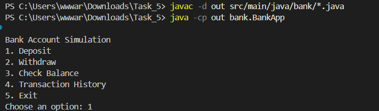
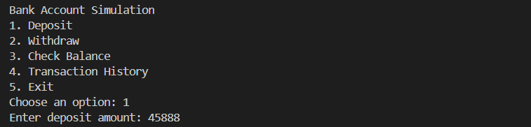
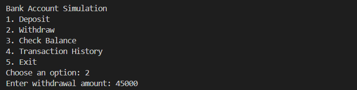
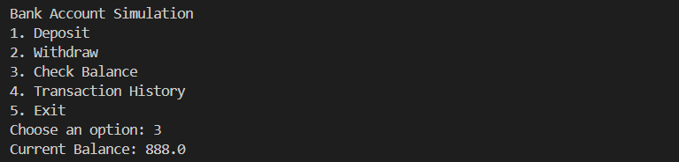
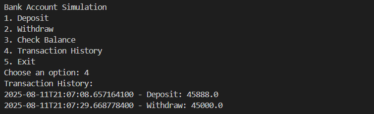
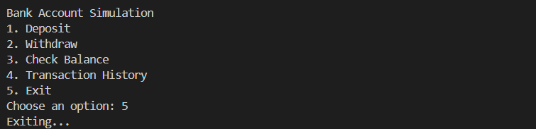

# bank-account-simulation

## Overview
This Java OOP project simulates basic bank operations: deposit, withdraw, balance inquiry, and transaction history.

## File Structure
```
bank-account-simulation/
│
├── src/
│   └── main/
│       └── java/
│           └── bank/
│               ├── Account.java
│               ├── Transaction.java
│               └── BankApp.java
│
├── screenshots/
│   ├── main-app.png
│   ├── deposit.png
│   ├── withdraw.png
│   ├── balance-inquiry.png
│   └── transaction-history.png
│
│
├── README.md
│
└── .gitignore
```


## How to Run
1. Open a terminal in the project root.
2. Compile all Java files:
	```shell
	javac -d out src/main/java/bank/*.java
	```
	This will create an `out/` folder with compiled `.class` files. A separate `bin` folder is not required unless you want to use it for compiled files; here, `out/` is used for simplicity.
3. Run the main application:
	```shell
	java -cp out bank.BankApp
	```
4. Alternatively, use your IDE's build/run features.

## Features
- Account class with deposit/withdraw methods
- Maintains account balance and transaction history
- Real-world scenario simulation


## Screenshots


Displays the main application UI.


Shows the deposit feature in action.


Shows the withdraw feature in action.


Displays the balance inquiry screen.


Shows the transaction history view.


Shows the exit confirmation screen.


## Author
Arpit Yadav
